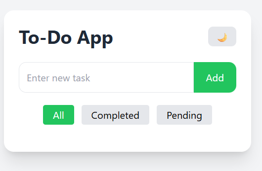
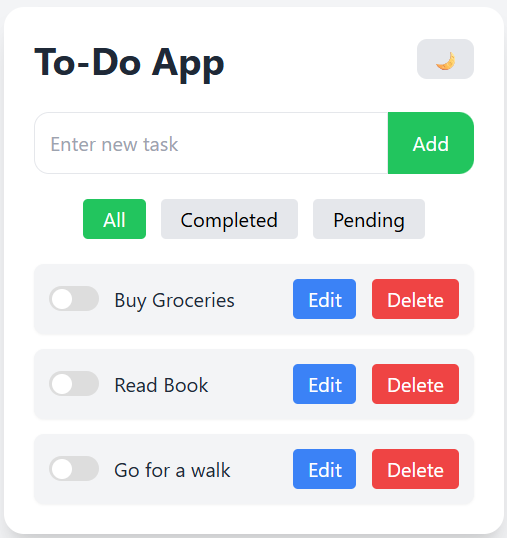
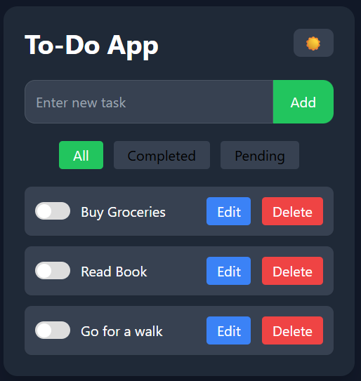
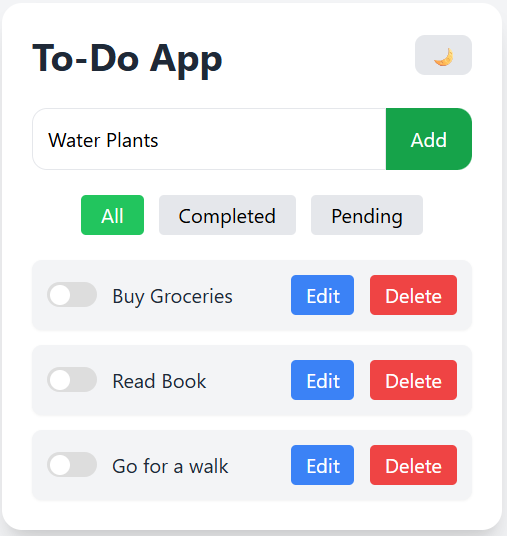
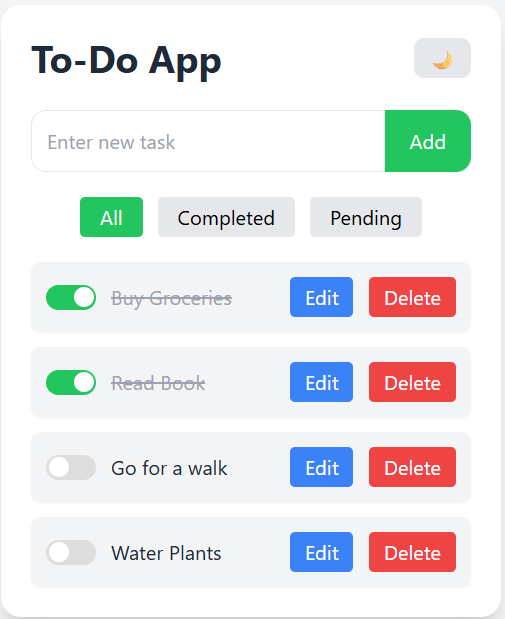
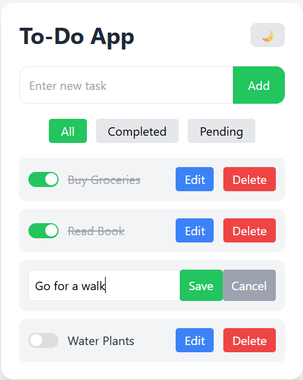
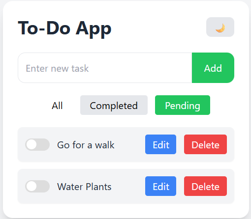
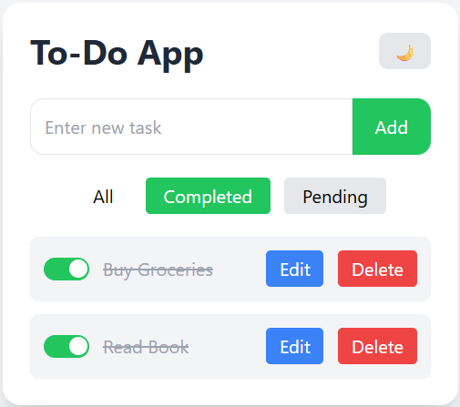

# To-Do App

An interactive To-Do application built using **Java Spring Boot** for the backend and **Vanilla JavaScript + Tailwind CSS** for the frontend. This app allows users to manage tasks efficiently, with support for filtering, editing, and dark mode.

---

## Features

### 1. **Add Tasks**
- Users can add new tasks with a simple input field.
- Tasks are stored in a backend database using **Spring Boot JPA**.

### 2. **Edit Tasks**
- Update the title of an existing task.
- Easy inline editing without reloading the page.

### 3. **Delete Tasks**
- Remove tasks permanently with a single click.

### 4. **Mark Tasks as Completed**
- Toggle task status between **pending** and **completed**.
- Visual feedback with a toggle switch and strikethrough for completed tasks.

### 5. **Filter Tasks**
- **All:** Show all tasks.
- **Completed:** Show only tasks marked as completed.
- **Pending:** Show tasks that are not yet completed.

### 6. **Dark Mode**
- Supports light and dark themes.
- Theme preference is saved in **localStorage** and persists across sessions.
- Toggle easily using the moon/sun button in the header.

### 7. **Responsive Design**
- Built with **Tailwind CSS** for a modern, responsive layout.
- Works well on both desktop and mobile screens.

---

### Screenshots
### Empty List


### Some Tasks


### Dark Mode


### Add Task


### Completed Task


### Edit Task


### Filter Pending Tasks


### Filter Completed Tasks


---

## Tech Stack

- **Backend:** Java, Spring Boot, Spring Data JPA
- **Frontend:** HTML, CSS, JavaScript
- **Styling:** Tailwind CSS
- **Database:** H2 / MySQL (Spring Boot JPA compatible)
- **Version Control:** Git & GitHub

---

## How It Works

1. The backend exposes a REST API (`/tasks`) to handle CRUD operations for tasks.
2. The frontend fetches data from the API and dynamically renders the task list.
3. Users can interact with tasks using buttons for editing, deleting, or marking as completed.
4. The filter buttons allow users to quickly switch between all, completed, and pending tasks.
5. Dark mode toggle changes the UI theme and remembers the user’s preference.

---

## Usage

1. Clone the repository:
   ```bash
   git clone <repo-url>
2. Run the Spring Boot backend:
   ./mvnw spring-boot:run
3. Open the index.html file in your browser.
4. Start adding, editing, deleting, and filtering tasks.
